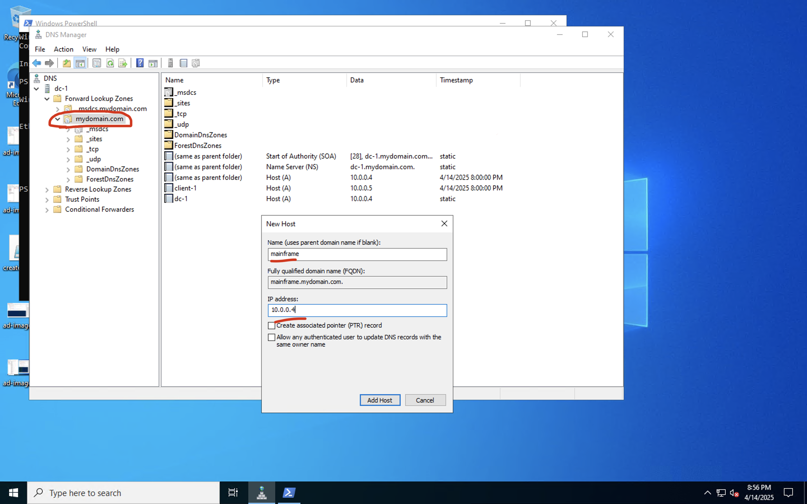
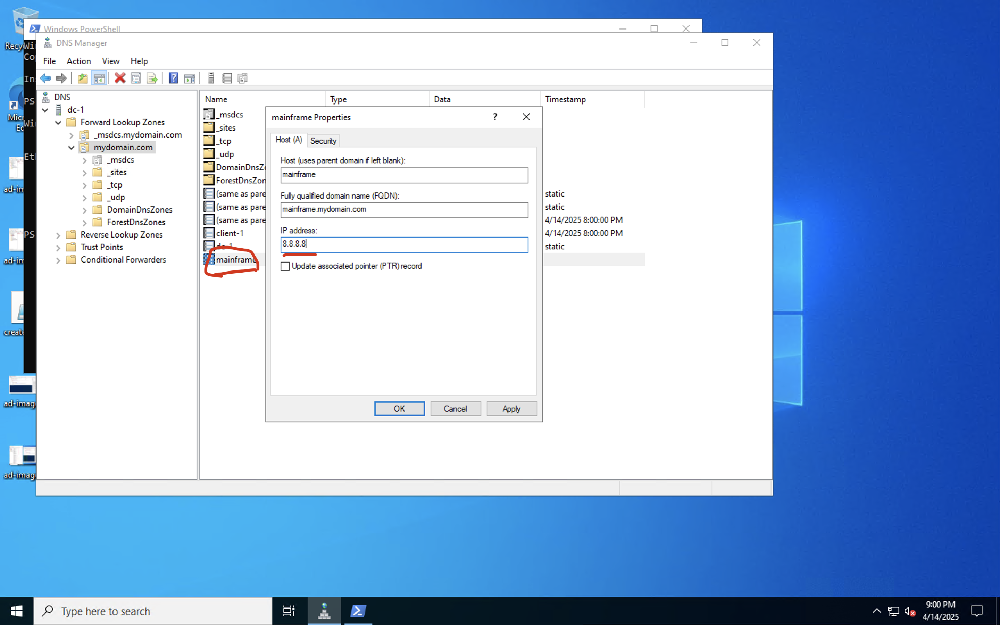

<h1>Building Intuition for DNS</h1>

  In this lab, I explore and experiment with the Domain Name System (DNS) to gain a deeper understanding of how it operates and supports network communication. Through practical exercises, I aim to enhance my knowledge of DNS functionality and its critical role in translating domain names into IP addresses.

 

<h2>Environments and Technologies Used</h2>
<ul>
  <li>Microsoft Azure (Virtual Machines / Compute)</li>
  <li>Remote Desktop</li>
  <li>DNS Management</li>
</ul>

<h2>Operating Systems Used</h2>
<ul>
  <li>Windows 10 (21H2)</li>
</ul>

<h2>List of Prerequisites</h2>
<ul>
  <li>A Virtual Machine configured with Active Directory</li>
  <li>A Client VM joined to your network/domain</li>
</ul>
 

<h2>Lab Steps</h2>

  Log into both the <strong>Client-1</strong> and <strong>DC-1</strong> virtual machines created in the Active Directory lab as the <strong>janeadmin</strong> user. 
  On the Client-1 machine, open PowerShell as an administrator and attempt to <code>ping mainframe</code>. 
  The computer will first check the local DNS cache (fastest), then the local hosts file (faster), and finally the DNS server (slowest). 
  The ping will fail because "mainframe" will not be located in any of these places.

  

 

  In PowerShell, run the command <code>ipconfig /displaydns</code> to view the DNS cache. 
  There will be no entry for "mainframe" in the cache.

  

 

  To check the local hosts file, open Notepad as an administrator.
  Navigate to: <strong>File → Open → change file type to "All Files" → Windows → System32 → drivers → etc → hosts</strong>.
  "mainframe" is not listed in the hosts file.

  Next, run <code>nslookup mainframe</code> in PowerShell. 
  Again, no results will be found because no DNS record exists yet.

  

 

  Now create a DNS A-record for "mainframe" pointing to DC-1’s private IP address.
  On DC-1, open Administrative Tools → DNS Manager → navigate to <strong>dc-1 → Forward Lookup Zones → mydomain.com</strong>.
  Right-click within <strong>mydomain.com</strong> and select <strong>New Host (A or AAAA)...</strong>.
  Enter <strong>mainframe</strong> as the name and <strong>10.0.0.4</strong> (DC-1's IP address) for the IP, then save the record.

  

 

  Back on Client-1, open PowerShell and try to ping "mainframe" again. 
  This time, the ping will succeed because the DNS server now resolves "mainframe."

  

 

  Update the A-record for "mainframe" on DC-1 to point to <strong>8.8.8.8</strong> (Google's public DNS IP).
  After updating, ping "mainframe" from Client-1 again. 
  It will still show the old IP address because Client-1 cached the previous DNS entry.

  

  

 

  Run <code>ipconfig /displaydns</code> again on Client-1 and locate the "mainframe" entry, which still points to the old IP (10.0.0.4).

  

 

  Clear the DNS cache by running <code>ipconfig /flushdns</code> on Client-1.
  This clears the old entry and forces Client-1 to query the DNS server again, reflecting the new IP (8.8.8.8).

  

 

  Attempt to ping "mainframe" once more from Client-1. 
  This time it successfully pings <strong>8.8.8.8</strong>, showing that the new A-record is now being used.

  

 

  Next, create a CNAME record on DC-1 that points "search" to "www.google.com."
  In DNS Manager, go to <strong>Forward Lookup Zones → mydomain.com</strong>, right-click and select <strong>New Alias (CNAME)...</strong>.
  Set <strong>Alias Name</strong> to <code>search</code> and <strong>Fully Qualified Domain Name (FQDN)</strong> to <code>www.google.com</code>.

  

 

  Return to Client-1 and ping "search." 
  It will resolve to www.google.com, verifying the CNAME record is working.

  

 

  Finally, run <code>nslookup search</code> from Client-1. 
  You should see that "search" resolves to www.google.com, confirming that the DNS alias is properly configured.

  

 

<h2>Summary</h2>

  In this lab, the hierarchy of DNS lookups was explored and demonstrated: 
  <strong>DNS Cache → Local Hosts File → DNS Server</strong>.  

  - Initially, a ping failed because no local or server record existed. 
  - An A-record was then created to allow successful resolution through the DNS server. 
  - Changing the IP address of the A-record showed how caching can lead to stale DNS entries, which were corrected by flushing the cache. 
  - A CNAME record was also created, demonstrating DNS aliasing by resolving "search" to "www.google.com."  

  This hands-on exercise reinforced how critical and dynamic DNS resolution is within real-world networks.

